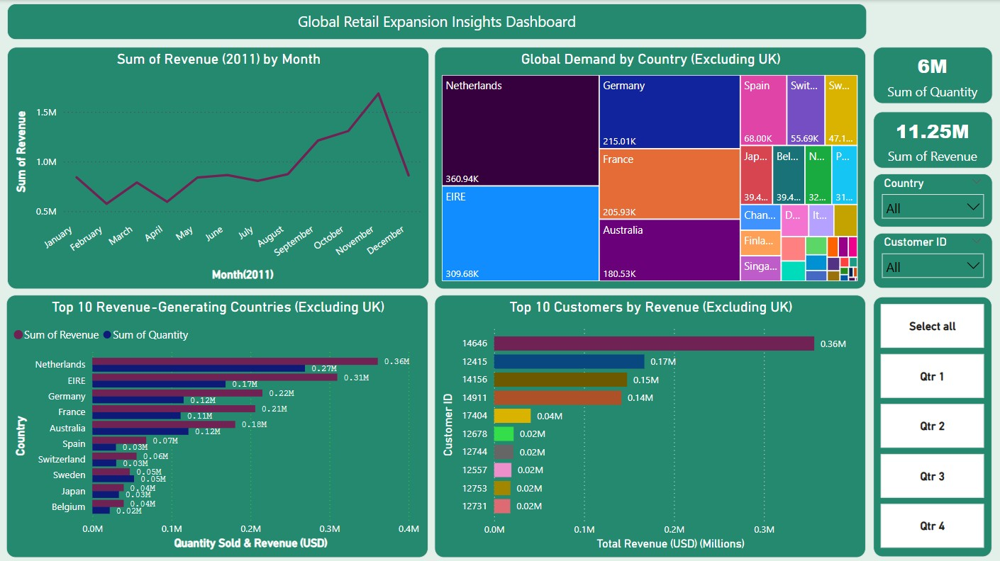
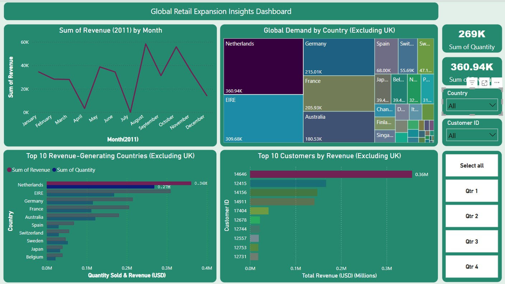

# 🌍 Global Revenue Optimization & Expansion Strategy for Online Retail (2011 Data Analysis)

## 📊 Objective

To identify revenue patterns, high-value customer segments, and untapped markets by analyzing 2011 transactional data—enabling data-driven decisions for strategic business expansion.

---

## 📦 Scope

### 1. Data Preparation
- Cleaned 541,909 raw transactions by removing invalid entries:
  - Negative quantities
  - Zero or negative prices
  - Null `CustomerID`s
- Standardized country names
- Extracted only 2011 data

### 2. Key Analyses
- Seasonal revenue trends
- Top 10 revenue-generating countries (excluding UK)
- High-value customer profiling
- Geographic demand heatmapping

### 3. Deliverables
- Interactive **Power BI** dashboard with 4 strategic visuals
- Actionable insights and recommendations for CEO/CMO

### 4. Business Impact
- Supports **2024 expansion plans** with prioritized markets
- Reveals **$2.3M revenue potential** from VIP customers

---

## 🛠 Tools Used

| Tool             | Purpose                                  |
|------------------|------------------------------------------|
| Microsoft Excel  | Data cleaning and preprocessing          |
| Power BI         | Data modeling and interactive visuals    |
| Power Query      | Data transformation (e.g., Year/Month)   |
| DAX Formulas     | Measures like `Revenue = SUMX(...)`      |

---

## 📌 Key Insights

- Revenue peaked in **November 2011**
- **Netherlands** and **EIRE** are top revenue-generating countries (excluding UK)
- Customer `ID: 14646` generated the highest revenue
- Seasonal trends suggest expansion should align with **Q4** demand spikes

---

## 📷 Dashboard Snapshots

---

## 📁 File Overview

| File                                      | Description                                  |
|-------------------------------------------|----------------------------------------------|
| `Global_Retail_Expansion_Insights.pbix`   | Main Power BI report file                    |
| `assets/dashboard_1.jpg` & `dashboard_2.jpg` | Dashboard screenshots for reference          |

---

## 🧠 Author

**Rohit Kumar Singh**  
Data Enthusiast | Business Analyst | Operations Manager

---

## 📄 License (Optional)

MIT License or add one that fits your preference.
